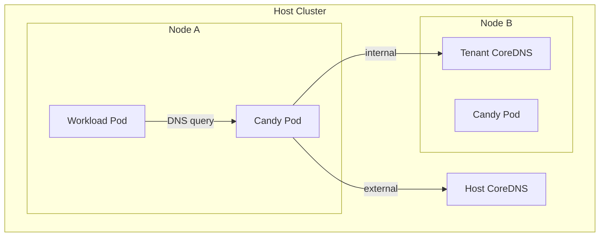

# vcluster-candy
**C**luster-**A**ware **N**ode-local **D**NS prox**Y** for [vcluster](https://www.vcluster.com/) workloads.

`vcluster-candy` runs as a DaemonSet on the host cluster and acts as a node-local
DNS proxy for pods that belong to vclusters. For each DNS query it inspects the
**source pod IP**, determines which vcluster the pod belongs to, and routes the
query to the right upstream:

- **Internal queries** (e.g. `*.cluster.local`) are forwarded to the
  vcluster's own `kube-dns` Service so that tenant workloads resolve names
  inside their virtual cluster.
- **External queries** are forwarded to the host node's upstream resolvers
  (read from `/etc/resolv.conf`).

Queries from pods that are not managed by a vcluster (i.e. that do not carry
the `vcluster.loft.sh/managed-by` label) are answered with `REFUSED`.

---

## How it works


1. The DaemonSet expects traffic from pods with the `vcluster.loft.sh/managed-by: <vcluster-name>` label.
2. On each DNS request, the proxy:
    - looks up the requesting pod by the source IP,
    - reads the `vcluster.loft.sh/managed-by` label to identify the vcluster,
    - if the query name matches one of the configured internal-domain
      suffixes, forwards it to the vcluster's `kube-dns` Service
      (`kube-dns-x-kube-system-x-<vcluster-name>` in the host cluster),
    - otherwise forwards it to the upstream servers from
      `/etc/resolv.conf`.
3. Pods that are not managed by a vcluster get `REFUSED` — this proxy is not
   intended to serve host-cluster workloads.

The Service exposed by the chart uses `internalTrafficPolicy: Local` so that each pod talks to the `vcluster-candy` instance running on its own node.

---

## Installation

### Prerequisites

- A Kubernetes cluster with vcluster instances running.
- Helm 3.
- A **stable ClusterIP** that you can reserve for the `vcluster-candy`
  Service. Workload pods will be configured (via vcluster's `dnsPolicy` /
  `dnsConfig`) to use this IP as their DNS server, so it must not change
  across re-installs.

### Install the chart

```bash
helm upgrade --install vcluster-candy ./chart \
  --namespace vcluster-candy --create-namespace \
  --set service.clusterIP=10.96.0.42
```

`service.clusterIP` is **required** — the install will fail without it.

### Point vcluster workloads at vcluster-candy

Configure your vcluster so that synced workload pods use the `vcluster-candy`

```yaml
# vcluster.yaml
sync:
  toHost:
    pods:
      enabled: true
      patches:
        - path: spec
          expression: |
            (value => {
              value.dnsPolicy = "None";
              value.dnsConfig.nameservers = ["10.96.0.42"]; 
              return value;
            })(value)
```

---

## Configuration

### Command-line flags

| Flag                          | Default            | Description                                                                            |
|-------------------------------|--------------------|----------------------------------------------------------------------------------------|
| `--dns-bind-address`          | `:53`              | Address the DNS server binds to (UDP and TCP listeners are started).                   |
| `--metrics-bind-address`      | `:9153`            | Address the Prometheus metrics endpoint binds to.                                      |
| `--health-probe-bind-address` | `:8081`            | Address the health/readiness endpoints bind to (`/healthz`, `/readyz`).                |
| `--internal-domain`           | `cluster.local`    | Comma-separated list of DNS suffixes considered "internal" to vclusters.               |
| `--resolvconf`                | `/etc/resolv.conf` | Path to the `resolv.conf` file used to discover upstream servers for external queries. |

Standard controller-runtime / zap logger flags are also accepted
(e.g. `--zap-log-level`, `--zap-devel`).

### Helm values (selected)

| Value                                       | Default                                                          | Description                                                                                                                            |
|---------------------------------------------|------------------------------------------------------------------|----------------------------------------------------------------------------------------------------------------------------------------|
| `image.repository`                          | `ghcr.io/loft-sh/vcluster-candy`                                 | Container image repository.                                                                                                            |
| `image.tag`                                 | chart `appVersion`                                               | Image tag.                                                                                                                             |
| `service.clusterIP`                         | _(required)_                                                     | Stable ClusterIP for the candy Service. **Must be set.**                                                                               |
| `resources`                                 | sensible defaults                                                | CPU/memory limits and requests.                                                                                                        |
| `podSecurityContext`                        | `runAsNonRoot: true`, seccomp RuntimeDefault                     | Pod-level security context.                                                                                                            |
| `securityContext`                           | drops all caps, adds `NET_BIND_SERVICE`, `readOnlyRootFilesystem` | Container-level security context (needed because the proxy binds privileged port 53).                                                  |
| `livenessProbe` / `readinessProbe`          | HTTP `:8081`                                                     | Probes against the controller-runtime health endpoints.                                                                                |
| `nodeSelector` / `tolerations` / `affinity` | empty                                                            | Standard pod scheduling controls.                                                                                                      |

See [`chart/values.yaml`](chart/values.yaml) for the complete list.

### RBAC

The chart creates a `ClusterRole` granting `get`, `list`, `watch` on
`pods` and `services` cluster-wide — needed to look up pods by IP and to
discover each vcluster's `kube-dns` Service.

---

## Observability

- **Metrics:** Prometheus metrics from the controller-runtime manager are
  exposed on `--metrics-bind-address` (default `:9153`).
- **Health:** `/healthz` and `/readyz` on `--health-probe-bind-address`
  (default `:8081`), wired up to the Helm chart's liveness/readiness probes.
- **Logs:** structured logs via [zap](https://pkg.go.dev/sigs.k8s.io/controller-runtime/pkg/log/zap).

---

## Development

### Layout

```
cmd/vcluster-candy/   # main entry point (controller-runtime manager + DNS server)
pkg/candy/            # DNS handler: pod lookup, routing decision, upstream forwarding
pkg/dnsserver/        # DNS server implemented as a manager.Runnable
pkg/util/             # helpers: resolv.conf parsing, suffix normalization, name hashing
chart/                # Helm chart
```

### Build

```bash
CGO_ENABLED=0 go build ./cmd/vcluster-candy/
```

### Test

```bash
./hack/test.sh
```

This runs `go test -race -coverprofile=...` against every package outside of
`vendor/`.

### Container image

A multi-stage `Dockerfile` builds a static binary and packages it on a
distroless non-root base:

```bash
docker build -t vcluster-candy:dev .
```

---

## License

See [LICENSE](LICENSE).
